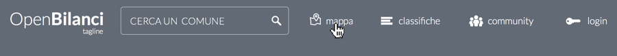
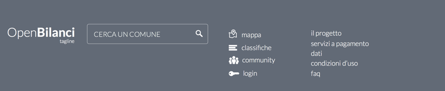
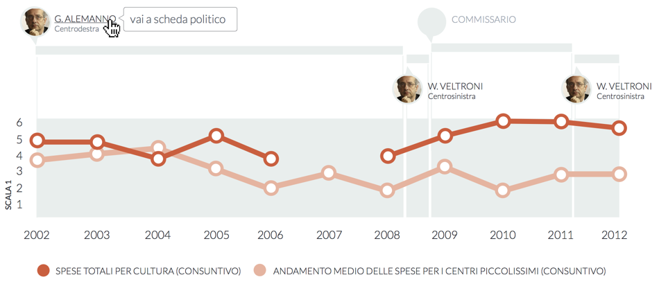
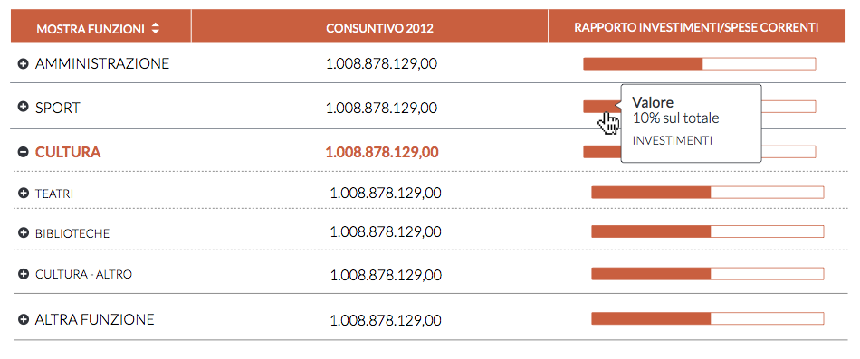
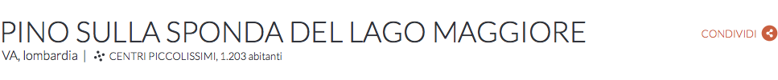
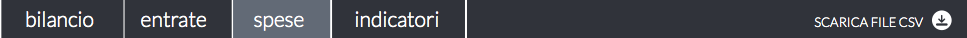
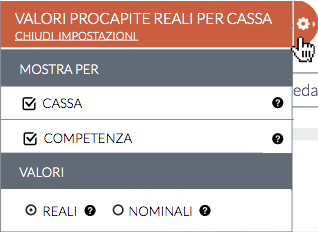

UI Elements
===========

This section of the documentation describes, with a certain amount of details, the various elements
that compose the web application.

Common elements
---------------

These are the elements present in any page.

.. _main-menu:

Main menu
+++++++++

The main menu component, appearing on top of every page.

The elements appearing in the menu are to be changed and will be:

* Logo + Tagline
* City autocompleter
* Link to classifiche
* Link to the Blog
* Link to Glossario (it's a link to wikipedia, actually)

.. _footer:

Footer
++++++

The elements appearing inside the footer are to be changed and will be:

* Logo + Tagline
* City autocompleter
* Link to classifiche
* Link to Glossario
* Links to static pages

  * il progetto
  * servizi a pagamento
  * dati
  * condizioni d'uso
  * faq

.. _lines-chart-over-the-years:

Lines chart over the years
++++++++++++++++++++++++++

This is a dynamic component, showing the linear chart of how given variables change over the years.
It is used in different contexts, to show entries or expenses vs. averages, or to compare indicators.

.. _accordion:

Accordion
+++++++++

The accordion is used in 2 different contexts:

* to show the detailed entries or expenses tree
* to show the comparison of a single indicator between two cities

Detailed entries or expenses tree
^^^^^^^^^^^^^^^^^^^^^^^^^^^^^^^^^

The accordion shows the list of tree voices.

A click on a dedicated icon allows to see the underlying lines chart, to see the trend over the years.
The cart appears as a modal window. It has a URI of its own, in order to be shared.

A click on the name, shows the underlying children list, hiding othe lists, if present (accordion behavior).

There may be at most three levels of depth in the tree.

Each item shows:

* the name,
* an icon to show the lines chart modal,
* the absolute and *pro-capite* value, expressed in Euro
* a *percentage* bar, showing the relation between expenses and investments (expenses context)

In the expenses context, the header's first label is a switch between the functions and investments voices.

Indicator comparison
^^^^^^^^^^^^^^^^^^^^

The accordion shows the list of voices.

There is no dedicated icon to show the line charts, because they are always shown when an item is expanded.

Each item shows just the name, and the underlying lines chart.

The chart shows the values of the selected indicator for the two selected cities.

Bilanci elements
----------------

Elements used in the bilanci section.

.. _city-data:

City and name data
++++++++++++++++++

The data shown are:

* complete name of the city (with the alternate name, if part of a bi-lingual region)
* province acronym
* region name
* cluster definition
* number of inhabitants (depend on the year)

.. _bilanci-menu:

Bilanci section navigation menu
+++++++++++++++++++++++++++++++

The navigation menu for the bilanci section. The section visited at the moment is highlighted.

.. _rollaway-menu-for-value-types:

Rollaway menu for value types
+++++++++++++++++++++++++++++

A menu that is not visible, if not for a handle, that when clicked shows it.

The menu allows to choice the euro values type (real or nominal values) and the
type of values shown when in the consuntivo context (competenza or cassa).

**TODO**: The choice between competenza or cassa must use radio buttons, since it's an alternative choice.

.. _city-positions-charts:

City positions charts
+++++++++++++++++++++

.. _rollaway-menu-with-for-indicators:

Rollaway menu for indicators selection
++++++++++++++++++++++++++++++++++++++

.. _timeline:

Timeline component
++++++++++++++++++

.. _budget-composition-widget:

Budget composition widget
+++++++++++++++++++++++++

.. _trend-and-analysis-charts:

Trend and analysis charts
+++++++++++++++++++++++++

Confronti elements
------------------

.. _cities-selector:

Cities selector
+++++++++++++++

.. _confronti-menu:

Confronti navigation menu
+++++++++++++++++++++++++

