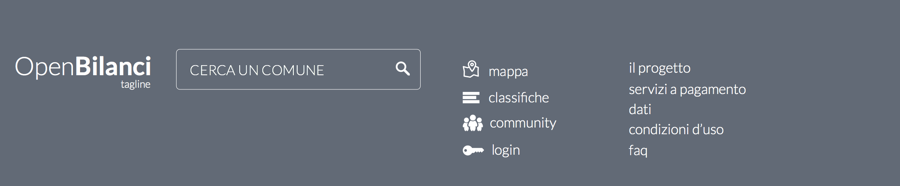

Page elements
=============

This section of the documentation describes, with a certain amount of details, the various elements
that compose the web application.

Common elements
---------------

These are the elements present in any page.

.. _main-menu:

Main menu
+++++++++

.. image:: _static/img/main-menu.png
    :width: 100%

* Logo + Tagline
* City autocompleter
* Link to classifiche
* Link to the Blog
* Link to Glossario (it's a link to wikipedia, actually)

.. _footer:

Footer
++++++

* Logo + Tagline
* City autocompleter
* Link to classifiche
* Link to Glossario
* Links to static pages

  * il progetto
  * servizi a pagamento
  * dati
  * condizioni d'uso
  * faq

.. _lines-chart-over-the-years:

Lines chart over the years
++++++++++++++++++++++++++

.. image:: _static/img/lines-chart-over-the-years.png
    :width: 100%

.. _accordion:

Accordion
+++++++++

.. image:: _static/img/accordion.png
    :width: 100%

Bilanci elements
----------------

Elements used in the bilanci section.

.. _city-data:

City and name data
++++++++++++++++++
.. image:: _static/img/city-data.png
    :width: 100%

.. _bilanci-menu:

Bilanci section navigation menu
+++++++++++++++++++++++++++++++
.. image:: _static/img/bilanci-menu.png
    :width: 100%

.. _rollaway-menu-for-value-types:

Rollaway menu for value types
+++++++++++++++++++++++++++++
.. image:: _static/img/rollaway-menu-for-value-types.png

.. _city-positions-charts:

City positions charts
+++++++++++++++++++++

.. _rollaway-menu-with-for-indicators:

Rollaway menu for indicators selection
++++++++++++++++++++++++++++++++++++++

.. _timeline:

Timeline component
++++++++++++++++++

.. _budget-composition-widget:

Budget composition widget
+++++++++++++++++++++++++

.. _trend-and-analysis-charts:

Trend and analysis charts
+++++++++++++++++++++++++

Confronti elements
------------------

.. _cities-selector:

Cities selector
+++++++++++++++

.. _confronti-menu:

Confronti navigation menu
+++++++++++++++++++++++++

