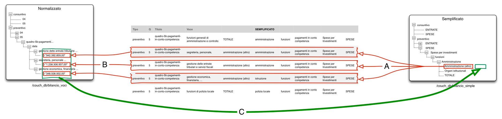

.. _simplify:

Simplify
========

This document explains the inner workings of the ``simplify`` management task, and is intended as a guide for
programmers.

The ``simplify`` script computes the values to be written in the ``bilanci_simple`` couchdb instance,
starting from the normalized ``bilanci_voci`` instance.

The tree is built using the ``build_tree`` method of the classes extending ``BudgetTreeDict``.

A ``build_tree`` method is passed the list of ``leaves``, and the ``mapping`` data,
containing both the normalized couchdb instance reference and the list of mappings, as read
from the GDocs.

Each leaf is a list of breadcrumbs, and for each leaf, the tree node is created, together with all
intermediate nodes (as in the unix ``mkdir -p`` command).

If a mapping has been passed to the ``build_tree`` method, then the value for the node, is computed
according to the following process, in the ``_compute_sum`` internal method.

    ``_compute_sum`` flow (click to enlarge)

A. All voices in normalized tree, matching the voce in simplified tree are identified (``_get_matching_voci``)
B. The corresponding value in the normalized treee is added to the value associated to the simplified voce (``_get_value``)
C. The leaf is actually added to the tree, together with the associated, computed value.

There are variations to this process, not described in detail here, when the ``interventi`` voci are considered,
but they are fully understandable, once this process is clear.

